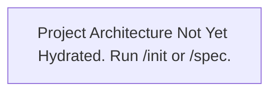

# PROJECT ARCHITECTURE & DESIGN SPECIFICATION

> **Agent Instruction**: This document is the Single Source of Truth for system architecture. Populate and update the sections below during `/init` or `/spec` based on the ACTUAL project codebase.

---

## 1. Core Tech Stack
- **Language(s)**: [To be populated by Agent during /init]
- **Framework(s)**: [To be populated by Agent during /init]
- **Storage & Caching**: [To be populated by Agent during /init]
- **Test Runner**: [To be populated by Agent during /init]

## 2. Directory Layout & Module Boundaries
- [Agent: List key directories and their specific layer responsibilities here]

## 3. System Data Flow & Topology

## 4. Key Architectural Invariants
- [Agent: List non-negotiable architectural rules, e.g. "API layer must never import DB entities directly", "All state changes must emit an audit log"]
