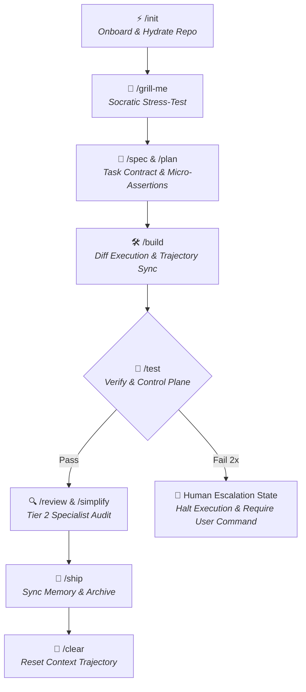

# 💨 EURUS AGENT v2.0 (`eurus-agent`)

> **Universal High-Efficiency AI Agentic Backbone Framework**  
> *Deterministic Control Plane · Trajectory Synchronization · Three-Tier Codified Context · 95%+ Token Economy*

---

## 🌟 Overview

**`eurus-agent v2.0`** is an advanced, production-grade AI Agent framework designed to transform any codebase into an **AI-Ready Environment**. Grounded in peer-reviewed AI Agent research (2026), it eliminates reasoning drift, prevents token bloat, and provides a deterministic control plane for AI coding assistants.

### Key Architectural Pillars (v2.0)
- ⚡ **Three-Tier Codified Context**: Tier 1 Constitution (<60 lines) + Tier 2 Specialist Agents (Regex triggered) + Tier 3 On-Demand Knowledge Base.
- 🧹 **Trajectory Synchronization (CORVUS)**: Automatic context deduplication—flushes outdated file snapshots, cutting prompt bloat by 15–32% and reasoning cycles by 37%.
- 🛡️ **Deterministic Control Plane**: Whitelisted package installation rules + 2-Retry Circuit Breaker with **Human Escalation State**.
- 🚀 **1-Minute Onboarding (`/init`)**: Auto-scans codebase topology and hydrates architecture into `.agent/` without touching dev configs.
- 🧠 **Dynamic On-Demand Skills (`/fetch-skill`)**: Semantically discovers and installs domain skills (`npx skills add`) on the fly.

---

## 🗺️ Master Architecture & Workflow



---

## 🚀 Quick Start & Usage Manual

### Step 1: Copy `.agent/` Backbone
Copy `.agent/`, `AGENTS.md`, and `.mcp.json` into your project root.

### Step 2: Initialize Project (`/init`)
Launch your preferred AI CLI (`jcode`, `antigravity`, `claude`) and run:
```text
/init
```

### Step 3: Standard Development Cycle
1. **`/spec <feature>`**: Define task contract in `.agent/specs/current-task.md`.
2. **`/plan`**: Deconstruct spec into atomic checkboxes `[ ]` with Micro-Assertions.
3. **`/build`**: Execute implementation via Search/Replace Diff blocks.
4. **`/test`**: Verify logic. If 2 fails occur, system enters **Human Escalation State**.
5. **`/ship`**: Validate Definition of Done, sync `hot_memory.json`, and archive spec.

---

## 📚 Research References & Scientific Foundations

`eurus-agent v2.0` is engineered directly upon findings from peer-reviewed AI Agent research:

1. 📄 **Việt Trần (2026)** — *"Tối ưu Coding Agent Codebase: 7 Best Practices Cho Dev"* (`goclaw.sh`).
   - *Applied*: Fast local validation (<5s), verbose assertion diagnostics (`Expected vs Actual`), and single source of truth documentation.
2. 📄 **Prakhar Khatri (2026)** — *"Do Context Files Help Coding Agents? A Two-Agent Ablation Study on Real Repositories"* (`arXiv:2607.27250`).
   - *Applied*: Minimalist prompt entrypoint (<60 lines), `SELECTIVE` dynamic context fetching, and procedural resource guardrails.
3. 📄 **CORVUS Research (July 2026)** — *"CORVUS: Context Optimization and Reduction Via Underlying Synced Trajectories"*.
   - *Applied*: Trajectory Synchronization—automatically deduplicating outdated file snapshots from conversation context.
4. 📄 **Control Plane Research (June 2026)** — *"A Deterministic Control Plane for LLM Coding Agents"*.
   - *Applied*: Deterministic Control Plane—package installation whitelisting and Human Escalation State on Circuit Breaker triggers.
5. 📄 **Codified Context Research (February 2026)** — *"Codified Context: Infrastructure for AI Agents in a Complex Domain"*.
   - *Applied*: Three-Tier Codified Context (Tier 1 Constitution -> Tier 2 Regex-Triggered Specialists -> Tier 3 On-Demand Knowledge).

---

## ⚡ Slash Commands Cheat Sheet

| Command | Description |
| :--- | :--- |
| **`/init`** | Auto-scan, hydrate, and onboard any codebase (New or Existing/Legacy). |
| **`/grill-me`** | Socratic learning interview to stress-test architecture & edge-cases. |
| **`/fetch-skill`**| Semantically search, discover, and install domain skills on-demand. |
| **`/skeleton`** | Context Virtualization: Extract type annotations & class signatures (-85% tokens). |
| **`/spec`** | Create formal task contract in `.agent/specs/current-task.md`. |
| **`/plan`** | Deconstruct spec into atomic work checkboxes `[ ]` with Micro-Assertions. |
| **`/build`** | Implement changes via Diff blocks with Trajectory Synchronization. |
| **`/test`** | Run verification with Deterministic Control Plane Human Escalation. |
| **`/review`** | Multi-persona audit (Architect + Security Auditor + DB Expert). |
| **`/ship`** | Validate DoD, sync `hot_memory.json`, and archive spec. |
| **`/benchmark`** | Run transparent, scientifically neutral benchmark suite locally. |

---

## 📜 License & Author

Developed with ❤️ by **EurusDevSec**. Built for developers who demand high-speed, zero-drift AI agent execution.
