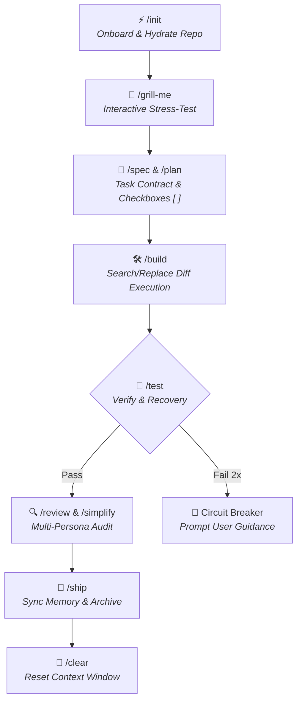

# 💨 EURUS AGENT (`eurus-agent`)

> **Universal High-Efficiency AI Agentic Backbone Framework**  
> *Zero-Drift Execution · 95%+ Token Economy · On-Demand Dynamic Skills · Stack-Agnostic*

---

## 🌟 Overview

**`eurus-agent`** is a production-grade, universal AI Agent framework designed to transform any codebase (fresh or existing legacy) into an **AI-Ready Environment**. Named after *Eurus (Εὖρος)*—the Greek god of the swift East Wind—it enforces rigorous Specification-Driven Development (SDD), dynamic state persistence, and multi-persona code auditing.

### Key Highlights
- ⚡ **95%+ Prompt Caching Savings**: Static rules (<100 lines entrypoint) maximize prompt cache hit rates on Anthropic & OpenRouter models.
- 🚀 **1-Minute Onboarding (`/init`)**: Agent-native scanner auto-hydrates tech stack, git history, and architecture into `.agent/` without overwriting existing dev configs.
- 🧠 **Dynamic On-Demand Skills (`/fetch-skill`)**: Auto-discovers and installs domain skills (`npx skills add`) for AI Model Eval, Observability, Data Filtering, and DB Migrations on the fly.
- 🛑 **2-Retry Circuit Breaker**: Prevents infinite error retry loops and protects API token budgets.
- 🌐 **Harness Agnostic**: Native compatibility with `jcode`, `antigravity`, `claude code`, `codex cli`, `cursor`, and `roo code`.

---

## 🗺️ Master Architecture & Workflow



---

## 🚀 Quick Start (1-Minute Setup)

### Step 1: Copy `.agent/` Backbone
Copy the `.agent/` directory, `AGENTS.md`, and `.mcp.json` into your project root.

### Step 2: Initialize Project (`/init`)
Launch your preferred AI CLI (`jcode`, `antigravity`, `claude`) in the project directory and run:
```text
/init
```
*The Agent will automatically inspect your codebase, detect language/framework boundaries, and populate `ARCHITECTURE.md` and `hot_memory.json`.*

---

## ⚡ Slash Commands Cheat Sheet

| Command | Description |
| :--- | :--- |
| **`/init`** | Auto-scan, hydrate, and onboard any codebase (New or Existing/Legacy). |
| **`/grill-me`** | Pressure-test plans and edge-cases through an interactive interview. |
| **`/fetch-skill <task>`**| Semantically search, discover, and install domain skills on-demand. |
| **`/spec`** | Create formal task contract in `.agent/specs/current-task.md`. |
| **`/plan`** | Deconstruct spec into atomic work checkboxes `[ ]` (<15 mins each). |
| **`/build`** | Implement changes strictly using Search & Replace Diff blocks. |
| **`/test`** | Run test suite with automated failure recovery (Circuit breaker: 2 fails). |
| **`/review`** | Multi-persona quality & security audit (Architect + Security + Tester). |
| **`/simplify`** | Clean up dead code and reduce cyclomatic complexity. |
| **`/ship`** | Validate Definition of Done, sync `hot_memory.json`, and archive spec. |

---

## 🤖 Harness Compatibility Matrix

| AI Harness / Client | Status | Configuration |
| :--- | :---: | :--- |
| **`jcode` / OpenRouter** | ✅ 100% Native | Reads `AGENTS.md` & `.agent/` |
| **`antigravity` (Google DeepMind)** | ✅ 100% Native | Reads `.agent/` & `.mcp.json` |
| **`claude code` (Anthropic)** | ✅ 100% Native | Reads `AGENTS.md` & `.agent/rules/` |
| **`cursor` / `roo code`** | ✅ 100% Native | Symlink or read `.agent/rules/` |

---

## 📂 Repository Structure

```text
eurus-agent/
├── AGENTS.md                  # Compact entrypoint (<100 lines) for LLM Prompt Caching
├── README.md                  # Human developer documentation & setup manual
├── WORKFLOW.md                # Full State Machine specification
├── ARCHITECTURE.md            # System architecture template & dynamic topology
├── FEATURES.md                # Project roadmap & milestone tracker
├── .mcp.json                  # MCP Server integrations (fetch, github, git)
└── .agent/
    ├── rules/                 # Universal principles (00-core, 01-code-style, 02-security)
    ├── skills/                # ⚡ Slash commands (/init, /grill-me, /spec, /build, /ship, etc.)
    ├── agents/                # 🎭 Personas (architect, tester, security-auditor)
    ├── references/            # 📚 Definition of Done & troubleshooting decision trees
    ├── evals/                 # 🧪 Skill verification suite (skill-evals.json)
    ├── memory/                # 🔥 Hot Memory (hot_memory.json) & ❄️ Cold Memory (cold_memory.md)
    └── specs/                 # Current active spec (specs/current-task.md)
```

---

## 📜 License & Author

Developed with ❤️ by **EurusDevSec**. Built for developers who demand high-speed, zero-drift AI agent execution.
