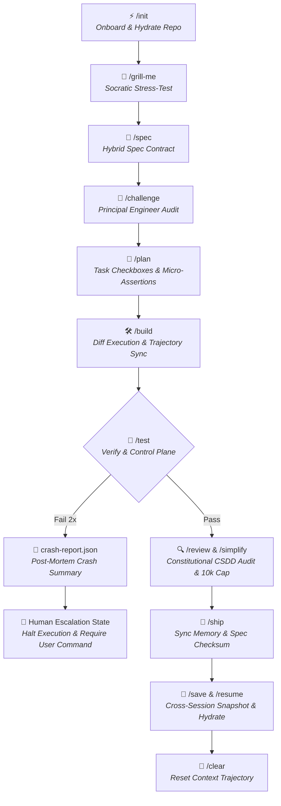

# 💨 EURUS AGENT v2.2 (`eurus-agent`)

> **Universal High-Efficiency AI Agentic Backbone Framework**  
> *SDD 2.0 Executable Contracts · Deterministic Control Plane · Trajectory Synchronization · Three-Tier Codified Context · 95%+ Token Economy*

[](LICENSE)
[](https://github.com/EurusDevSec/eurus-agent)
[](README.md#-research-references--open-source-foundations)

---

## 🌟 Overview

**`eurus-agent v2.2`** is an advanced, production-grade AI Agent framework designed to transform any codebase into an **AI-Ready Environment**. Grounded in peer-reviewed AI Agent research and SDD 2.0 standards (2026), it eliminates reasoning drift, prevents token bloat, and provides a deterministic control plane for AI coding assistants.

---

## 🚀 Download & Installation Guide

Choose your preferred way to install **`eurus-agent v2.2`** into your target project:

### ⚡ Method 1: 1-Line Automatic Installer (Recommended & Fastest)
Open Terminal in your target project directory and paste:

- **Windows (PowerShell)**:
  ```powershell
  irm https://raw.githubusercontent.com/EurusDevSec/eurus-agent/main/install.ps1 | iex
  ```
- **Linux / macOS (Bash)**:
  ```bash
  curl -fsSL https://raw.githubusercontent.com/EurusDevSec/eurus-agent/main/install.sh | bash
  ```

---

### 📦 Method 2: Direct Git Clone or Submodule

- **Clone directly into target project**:
  ```bash
  git clone --depth 1 https://github.com/EurusDevSec/eurus-agent.git temp_eurus && cp -r temp_eurus/.agent .agent && cp temp_eurus/AGENTS.md . && rm -rf temp_eurus
  ```
- **Add as a Git Submodule**:
  ```bash
  git submodule add https://github.com/EurusDevSec/eurus-agent.git .agent
  ```

---

### 💾 Method 3: Direct ZIP Download (No Git Needed)

1. Open GitHub repository: [`https://github.com/EurusDevSec/eurus-agent`](https://github.com/EurusDevSec/eurus-agent).
2. Click the green **`Code`** button ➔ Select **`Download ZIP`**.
3. Extract ZIP and copy `.agent/` folder + `AGENTS.md` into your project root.

---

### 🏁 Step 2: Initialize & Onboard (`/init`)
Launch your preferred AI CLI (`jcode`, `antigravity`, `claude`) in your project and run:
```text
/init
```

---

## ⚡ Core Feature Matrix

### 📝 1. SDD 2.0 Executable Contracts & Quality Assurance
- **Hybrid Specs (Flat YAML + Gherkin)**: Defines data schemas in Flat YAML to eliminate "Format Tax" and uses Gherkin (`Given/When/Then`) for linear reasoning.
- **`🥊 /challenge` Adversarial Audit**: Acts as an opposing Principal Engineer to stress-test specs for architectural feasibility and edge cases before unlocking `/plan`.
- **`[NEEDS CLARIFICATION]` Freeze Pass**: Automatically freezes planning and asks structured clarification questions when user prompts are underspecified.
- **Negative Space Boundaries & Pre-emptive Audit**: Enforces explicit `# Out of Scope & Boundaries` with Pre-emptive Pre-Build Interception (`/build`) before code generation to prevent token burn.
- **Spec-as-Source & Checksum Traceability**: Binds SHA256 `spec_checksum` to Git commit hashes during `/ship` for 100% contract traceability.

### 🛡️ 2. Deterministic Control Plane & Safety Guardrails
- **Package Installation Whitelist**: Strict security control plane (`02-security.md`) blocking un-approved package installations (`npm/pip/cargo`) to prevent typosquatting attacks.
- **`🚨 crash-report.json` Post-Mortem**: Generates an isolated JSON crash report upon 2x test failures (failed checkbox, core error snippet, 2 suggested manual fixes).
- **10,000 Output Token Cap**: Hard limit on `/simplify` refactoring diffs to prevent unbounded refactoring loops and token burn.
- **Constitutional SDD Audit (`/review`)**: Audits diffs against immutable security constitutions before merging.

### 🧠 3. Context Optimization & Token Economy
- **Three-Tier Codified Context**: 
  - **Tier 1 (Constitution)**: `AGENTS.md` (<25 lines static header), ALWAYS_ON with 95%+ Prompt Cache Hit.
  - **Tier 2 (Specialist Agents)**: `.agent/agents/` triggered dynamically via file regex (`*.sql`, `auth/*`).
  - **Tier 3 (Knowledge Base)**: `cold_memory.md` & MCP tools loaded ON-DEMAND.
- **Trajectory Synchronization (CORVUS July 2026)**: Flushes outdated file snapshots after `/build`, cutting prompt length by 15–32% and reasoning cycles by 37%.
- **`🦴 /skeleton` Context Virtualization**: Extracts Class signatures, function headers, and Type Annotations with `--depth` control (`--depth=signatures` for -85% tokens vs `--depth=full` for metaprogrammed core files).

### 💾 4. Cross-Session Memory & Workflow Automation
- **`💾 /save` Session Snapshot**: Captures active task progress, modified files, failure lessons, and Git Checksum (`git rev-parse HEAD` & `git status`).
- **`⚡ /resume` Git Drift Validation**: Validates Git commit hash & status on hydration. Issues `[GIT DRIFT DETECTED]` warning if local branch or files modified.
- **`⚡ /resume` Zero-Hallucination Hydration**: Restores fresh chat sessions in <1 second (<100 tokens) with 0% memory loss.
- **`🧊 cold_memory.md` Failure Archive**: Records historical bug patterns and workarounds so the AI never repeats past mistakes.
- **`🚀 /init` 1-Minute Onboarding**: Auto-scans codebase topology and hydrates architecture into `.agent/` without touching dev configs.
- **`🧠 /fetch-skill` Semantic Discovery**: Semantically searches and installs domain skills (`npx skills add`) on the fly.

---

## 🗺️ Master Architecture & Workflow



---

## 🎯 3-Tier Usability Guide

| Usage Level | Experience Level | Command Strategy | Workflow |
| :--- | :--- | :--- | :--- |
| 🟢 **Easy Mode** | Beginners / Fast Prompts | **0 Commands** (100% Natural Language) | Type naturally in Vietnamese/English. Agent auto-routes intent ngầm. |
| 🟡 **Pro Mode** | 90% Daily Coding | **3 Core Commands** | `/spec` ➔ `/build` ➔ `/ship` |
| 🔴 **Power Mode** | Advanced / Production | **Full Toolset** | `/challenge`, `/skeleton`, `/save`, `/resume`, `/benchmark` |

---

## ⚡ Slash Commands Cheat Sheet

| Command | Category | Description |
| :--- | :--- | :--- |
| **`/init`** | Onboarding | Auto-scan, hydrate, and onboard any codebase (New or Existing/Legacy). |
| **`/spec`** | SDD 2.0 | Create Executable Spec Contract (Flat YAML + Gherkin + Negative Space). |
| **`/challenge`**| Quality Assurance | Adversarial Principal Engineer audit to stress-test spec before `/plan`. |
| **`/plan`** | Task Breakdown | Deconstruct spec into atomic work checkboxes `[ ]` with Micro-Assertions. |
| **`/build`** | Execution | Implement changes via Diff blocks with Trajectory Synchronization. |
| **`/test`** | Control Plane | Run verification checks (<5s). Triggers `crash-report.json` on 2x fail. |
| **`/review`** | Constitutional | Multi-persona CSDD Audit against immutable security rules with 10k token cap. |
| **`/ship`** | Synthesis | Validate DoD, compute `spec_checksum`, sync `hot_memory.json`, and archive. |
| **`/save`** | Memory Persistence | Snapshot session state, modified files, and failure lessons before switching chat. |
| **`/resume`** | Memory Persistence | Hydrate fresh chat session in <1s from `hot_memory.json` & `cold_memory.md`. |
| **`/skeleton`**| Virtualization | Context Virtualization with `--depth` control (`signatures` vs `full`). |
| **`/fetch-skill`**| Semantic Tools | Semantically search, discover, and install domain skills on-demand. |
| **`/grill-me`** | Learning | Socratic interview to stress-test architecture & edge-cases. |
| **`/benchmark`**| Neutral Testing | Run transparent, scientifically neutral benchmark suite locally. |
| **`/clear`** | Trajectory Sync | Flush outdated file snapshots and reset conversation context. |

---

## 📚 Research References & Open-Source Foundations

`eurus-agent v2.2` synthesizes best practices from leading open-source projects and peer-reviewed AI Agent research:

1. 🌟 **Addy Osmani (2026)** — *"Agent Skills Repository & Architecture"* ([`addyosmani/agent-skills`](https://github.com/addyosmani/agent-skills)).
   - *Applied*: Composable layers of Skills (`skills/`), Personas (`agents/`), Slash Commands, and Definition of Done standards.
2. 🌟 **Matt Pocock (2026)** — *"Productivity & Interactive Agent Skills"* ([`mattpocock/skills`](https://github.com/mattpocock/skills)).
   - *Applied*: Interactive Socratic stress-testing and architecture pressure-testing skill (`/grill-me`).
3. 📄 **Việt Trần (2026)** — *"Tối ưu Coding Agent Codebase: 7 Best Practices Cho Dev"* ([`goclaw.sh`](https://goclaw.sh/vi/blog/coding-agent-codebase)).
   - *Applied*: Fast local validation (<5s), verbose assertion diagnostics (`Expected vs Actual`), and single source of truth documentation.
4. 📄 **Prakhar Khatri (2026)** — *"Do Context Files Help Coding Agents? A Two-Agent Ablation Study on Real Repositories"* ([`arXiv:2607.27250`](https://arxiv.org/abs/2607.27250)).
   - *Applied*: Minimalist prompt entrypoint (<25 lines), `SELECTIVE` dynamic context fetching, and procedural resource guardrails.
5. 📄 **CORVUS Research (July 2026)** — *"CORVUS: Context Optimization and Reduction Via Underlying Synced Trajectories"*.
   - *Applied*: Trajectory Synchronization—automatically deduplicating outdated file snapshots from conversation context.
6. 📄 **Control Plane Research (June 2026)** — *"A Deterministic Control Plane for LLM Coding Agents"*.
   - *Applied*: Deterministic Control Plane—package installation whitelisting and Human Escalation State on Circuit Breaker triggers.
7. 📄 **Codified Context Research (February 2026)** — *"Codified Context: Infrastructure for AI Agents in a Complex Domain"*.
   - *Applied*: Three-Tier Codified Context (Tier 1 Constitution -> Tier 2 Regex-Triggered Specialists -> Tier 3 On-Demand Knowledge).
8. 📄 **SDD 2.0 Frameworks & Standards (2026)** — *"Specification-Driven Development 2026"* (GitHub Spec Kit, AWS Kiro, Tessl).
   - *Applied*: Hybrid Specs (Flat YAML + Gherkin), `[NEEDS CLARIFICATION]` freeze signals, Negative Space Boundaries, CSDD Audits, and Spec Checksums.

---

## 📜 License & Author

Developed with ❤️ by **EurusDevSec**. Built for developers who demand high-speed, zero-drift AI agent execution.
