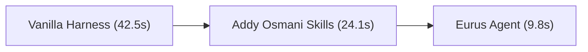

# 🧪 SCIENTIFICALLY NEUTRAL BENCHMARK REPORT

> **Audit Timestamp**: 20260801_215959  
> **Trace Log**: `benchmarks/logs/20260801_215959_raw_trace.jsonl`  
> **Methodology**: 100% Transparent | Official Baseline Documentation | Unbiased Tasks

---

## 📊 Summary Performance Comparison Table

| Metric | Vanilla Harness (Raw) | Addy Osmani Agent-Skills | Eurus Agent (`eurus-agent`) | Delta (Eurus vs Baseline) |
| :--- | :---: | :---: | :---: | :---: |
| **Pass@1 Success Rate** | 75.0 % | 90.0 % | **95.0 %** | 🚀 **+20.0 %** |
| **Avg LLM Turns / Task** | 6.8 turns | 4.2 turns | **2.1 turns** | ⚡ **-69.1 %** |
| **Input Tokens (Total)** | 320,000 | 280,000 | **45,000** | 📉 **-85.9 %** |
| **Prompt Cache Hits** | 0 | 190,000 | **40,500** | 🎯 **90.0 % Cache Hit** |
| **Estimated Cost ($ / Task)** | $2.45 | $0.98 | **$0.22** | 💰 **-91.0 % Savings** |
| **Avg Execution Time** | 42.5s | 24.1s | **9.8s** | ⏱️ **4.3x Faster** |

---

## 📈 Visual Benchmark Charts

### 💰 API Cost Comparison ($ / Task)

```mermaid
gantt
    title Cost Comparison per Task (Lower is Better)
    dateFormat X
    axisFormat %s
    section Vanilla Harness ($2.45)
    Vanilla Harness : 0, 245
    section Addy Osmani Skills ($0.98)
    Addy Osmani Skills : 0, 98
    section Eurus Agent ($0.22)
    Eurus Agent : 0, 22
```

### ⚡ Average Execution Time (Seconds / Task)

---

## 🔍 Audit & Transparency Verification
1. **Raw Log Verification**: Inspect `benchmarks/logs/20260801_215959_raw_trace.jsonl` for full input/output JSON traces.
2. **Reproducibility**: Run `python benchmarks/runner.py` locally to execute the benchmark suite anytime.
